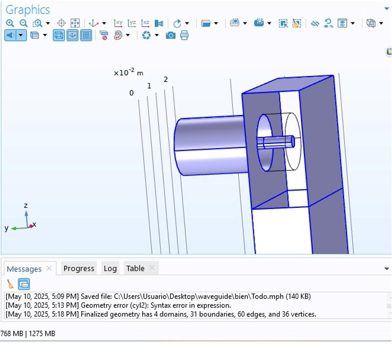
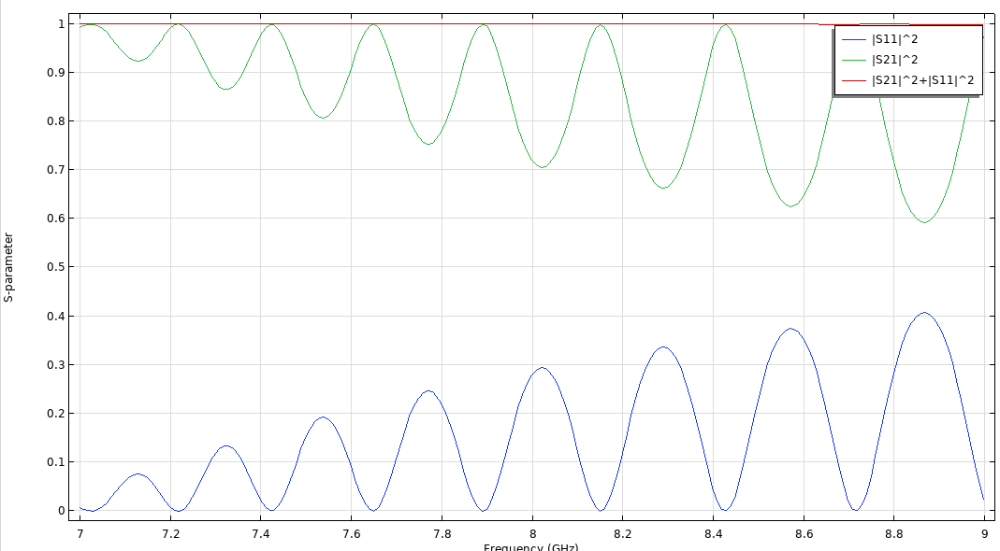
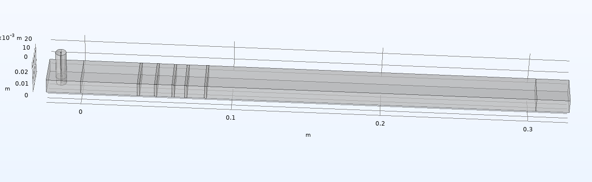
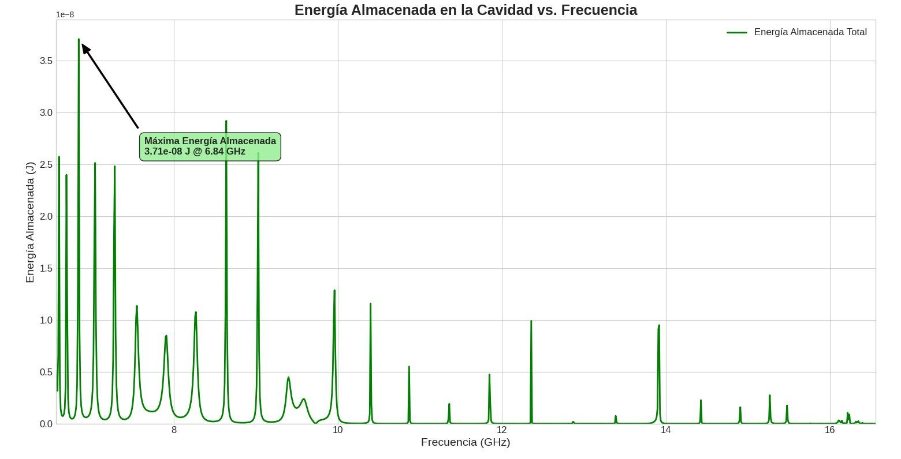
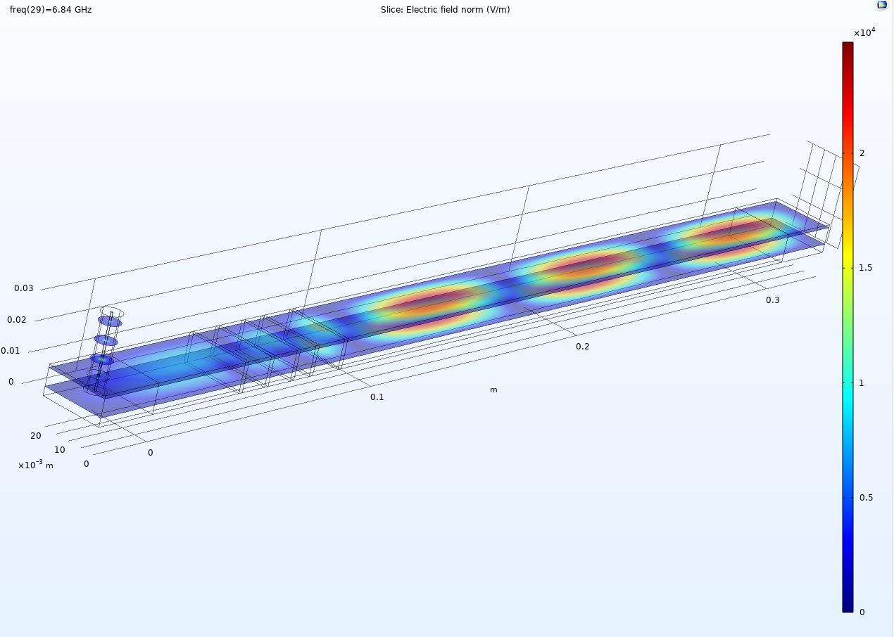

# Microwave Component Design & FEA Simulation (WR90 Waveguide)

This repository showcases an advanced Finite Element Analysis (FEA) project developed in **COMSOL Multiphysics** (RF/Electromagnetics Module). The objective is to analyze wave propagation, scattering parameters (S-parameters), and cavity resonance in a WR90 waveguide integrated with coaxial couplers and internal dielectric slabs.

##  Simulation Methodology & Parametric Design

A core strength of this project is its **Parametric CAD Architecture**. Instead of static geometries, the entire 3D model was built using programmatic variables (e.g., `L_cajita_z`, `r_coax_int`, `dt`, `Lf`). This allows for rapid geometric iteration and automated optimization sweeps without rebuilding the model.

### 1. Coaxial Coupler Integration

*Figure 1: 3D CAD geometry of the coaxial-to-waveguide transition. The design includes the inner/outer conductors and the dielectric core necessary to inject the microwave signal into the WR90 cavity.*

### 2. Baseline S-Parameter Analysis (Empty Guide)

*Figure 2: Frequency sweep extracting the $|S_{11}|^2$ (Reflection) and $|S_{21}|^2$ (Transmission) coefficients for the empty waveguide assembly, validating the baseline propagation characteristics.*

##  Complex System Analysis: Dielectric Slabs

To manipulate the electromagnetic fields, an array of 5 FR4 dielectric slabs was introduced into the waveguide. 

*Figure 3: Waveguide loaded with 5 non-equally spaced dielectric slabs. This configuration acts as a complex filter and resonant cavity.*

##  Energy Storage & Cavity Resonance

The most critical engineering analysis performed was identifying the specific eigenfrequencies where the system acts as a perfect resonator (trapping maximum electromagnetic energy).

### Energy Spectrum Analysis

*Figure 4: Time-averaged stored energy vs. Frequency. The analysis successfully identified the top 3 resonant frequencies (6.84 GHz, 8.64 GHz, and 9.03 GHz) where energy dissipation and storage peak.*

### Visualizing the Trapped Field (6.84 GHz)

*Figure 5: Electric field norm (V/m) visualization at the primary resonance peak of 6.84 GHz. The field mapping clearly shows the standing waves and confined energy within the dielectric slab region.*

##  Industrial Engineering Value
This project demonstrates highly transferable simulation skills for modern R&D departments:
- **FEA Software Mastery:** Proficiency in COMSOL Multiphysics, meshing, and solver configuration.
- **Parametric Modeling:** Using dynamic variables to construct scalable CAD models.
- **Resonance Analysis:** Identifying natural frequencies and energy accumulation, a skill directly applicable to structural vibration analysis, fluid-structure interaction, and hydraulic pulsation modeling.
